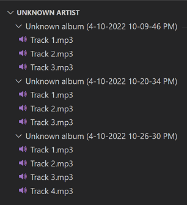
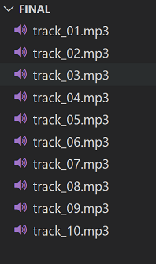
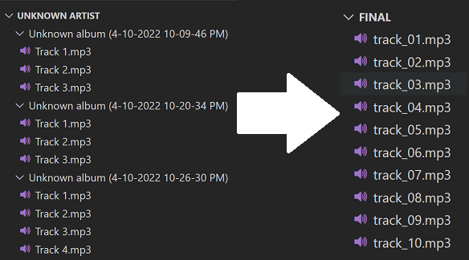

# playlist_org

Organize an audio playlist optimized for [SanDisk Clip Jam MP3 Player](./docs/clipjam.pdf)

## The Problem(s)

I own a lot of audio books on CDs. Audio books always come with multiple CDs. Each CD typically has a dozen or so MP3s. I want to listen to those MP3s on my audio player. When I rip the CD using Windows Media Player it will create a folder and place the tracks on that CD into the folder. In the below example I have burned three CDs; each CD generates its own folder and each track in that folder starts at track 1 through track n.



However, this is not ideal. The MP3 player expects one folder with all tracks in sequential order.



One additional problem is that the player can, at most, have 128 tracks in a single folder.

## The Solution

This program, [audio.py](./organizer/audio.py), will address the problems outlined above. First and foresmost a little setup is needed. This [configuration file](./organizer/config.py) must be specify the source MP3s directory, the directory where the generated MP3s should be placed, and the maximum number of tracks allowed (again this specific player has a maxium of 128).
Once this one-time setup is complete we can run our program which will move/rename files (using a transient file for bookkeeping) from their source directory into the destination directory resulting in the following:



If necessary we'll have to combine tracks if we are going to go over 128. So for instance if we have 130 MP3s in our destination folder, we'll combine tracks #1 and #2 together, then tracks #3 and #4, and so on for a new, acceptable total of 75 tracks.

Once completed we can now copy the folder onto our device via usb cable and enjoy our audio book!

## Runbook

### Prerequistes

[python3](https://www.python.org/downloads/) and configure [configuration file](./organizer/config.py) properly

### Execution

```bash
cd organizer
python audio.py
```

## Testing

The unittest module is used for all testing purposes.

### Execute all tests

```bash
cd organizer
python -m unittest discover
```

### Execute singular test

```bash
python -m unittest tests.test_basic
```
